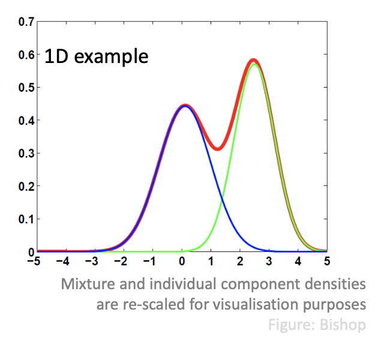
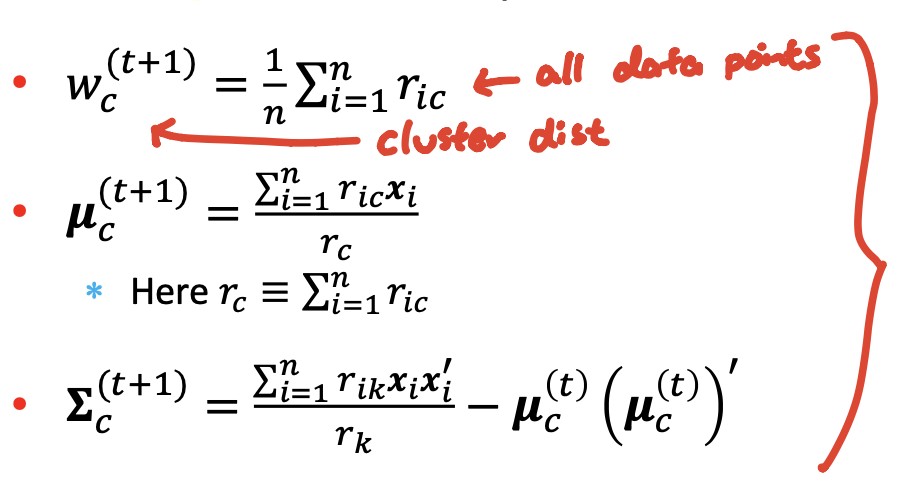

### Lecture 18: Gaussian Mixture Model, Expectation Maximization

#### Unsupervised learning
* Aim: explore the structure (pattern, regularities) of the data
* Tasks:
  * Clustering (e.g. GMM)
  * Dimensionality Reduction (e.g. PCA)
  * Learning parameters of probabilistic models
* Applications:
  * Market basket analysis
  * Outlier detection
  * Unsupervised tasks in (supervised) ML pipelines

#### Gaussian Mixture Model (GMM)
* A probabilistic view of clustering
* Requires the user to choose the number of clusters in advance
* Gives a power to express **uncertainty about the origin** ("weights") of each point
  * Each point originates from cluster $c$ with probability $w_c$, $c = 1, ..., k$
* Still originats from one particular cluster, but not sure from which one
* Data points are samples from **a mixture of K distributions (components)**
  * In principle, we can adopt any probability distribution for the components
  * Howeer, normal distribution is a common modelling choice -> GMM
* (d-dimensional) Gaussian distribution
  * $N(x | \mu, \Sigma) = (2\pi)^{-\frac{d}{2}} |\Sigma|^{-\frac{1}{2}} \exp(-\frac{1}{2}(x - \mu)^T \Sigma^{-1} (x - \mu))$
* Gaussian Mixture Distribution: (for each data point)
  * $P(x) = \Sigma_{j=1}^k w_j N(x | \mu_j, \Sigma_j) = \Sigma_{j=1}^k P(C_j) P(x|C_j)$
  * $P(x | C_j)$ is **conditional density** for component $j$
  * Here $P(C_j) \geq 0$ and $\Sigma_{j=1}^k P(C_j) = 1$
  * (Unkown) params of the model are:
    * $P(C_j), \mu_j, \Sigma_j$ for $j = 1, ..., k$
  
  

#### Clustering as model estimation
* Clustering now amounts to **finding parameters** of the GMM that "best explain" the observed data
  * -> **MLE** that maximise $p(x_1, ..., x_n)$

#### Fitting the GMM
* Aim: find parameters that maximise $p(x_1, ..., x_n)$
* Cannot solve analytically by taking (first) derivative!
  * Solution: Use **Expectation-Maximisation (EM)**

#### Expectation Maximisation (EM) algorithm
* Motivation:
    1. Sometimes we **don't observe** some of the variables needed to compute the log-likelihood
        * Hidden variables
    2. Sometimes the form of log-likelihood is inconvenient to work with
        * (No closed form solution...)
 * EM is an algorithm
   * A way to **solve the problem posed by MLE**
   * Especially **convenient** under unobserved latent variables
 * MLE can be found by other methods
   * E.g. Gradient Descent

#### Algorithm (Simple version)
1. Initialisation $K$ clusters and their parameters
2. Iteration Step:
   * E-step:
     * Estimate the cluster of each data point
   * M-step:
     * Re-estimate the cluster parameters
       * $(\mu_j, \Sigma_j), p(C_j)$ for each cluster $j$

#### EM for GMM and generally
* EM is a general tool
  * Purpose: implement MLE under latent (missing) variables Z
* Variables and params in GMM
  * Variables: 
    * Observed: Point locations $X$
    * Hidden: Cluster assignments $Z$
  * Parameters: 
    * $\theta$: cluster locations and scales (and $p(C_j)'s$)
* What EM is really doing:
  * Coordinate ascent on **lower-bound on the log-likelihood**
    * M-step: ascent in modelled parameter $\theta$
    * E-step: ascent in marginal likelihood $P(Z)$
    * Each step moves towards a local optimum
    * Can get stuck (at local optima)
      * Need random restarts

#### Not-Examinable Part
* Log is a convex function (can use Jensen's inequality)
* Maximise $\log p(X|\theta)$ difficult
  * Maximise $\log p(X, Z|\theta)$ (log complete likelihood) instead
* Marginalise and use Jensen's Inequality to get lower-bound $E_Z [\log \frac{p(x,z|\theta)}{p(z)}]$
  * Note: $p(z) = p(z | x, \theta)$
* Maximising lowerbound:
  * **Equivalent** to maximising original incomplete likelihood
  * Since $p(z) = p(z | x, \theta)$ makes the lower bound tight
* Resulting EM algorithm:
  1. Initialisation: choose random initial values of $\theta^{(1)}$
  2. Update:
      * E-step: compute $Q(\theta, \theta^{(t)}) = E_{Z|X, \theta^{(t)}} [\log p(X, Z | \theta)]$
  3. Termination: If no change then stop
  4. Go to step 2
* The algorithm could results in local maximum

#### Estimating Parameters of GMM
* Can't compute the complete likelihood because we don't know z
* EM handles this by replacing $\log p(X,z|\theta)$ with $E_{Z|X, \theta^{(t)} [\log p(X,z|\theta)]}$
  * Requires: $p(z|X,\theta^{(t)})$
  * Assuming $z_i$ are pairwise independent, we need $P(z_i = c | x_i, \theta^{(t)})$
* E-step: calculating **cluster responsibility** (weights)
  * Use Bayes rule: $r_{ic} = P(z_i = c | x_i, \theta^{(t)}) = \frac{w_c N(x_i | \mu_c, \Sigma_c)}{\Sigma_{l=1}^k w_l N(x_i | \mu_l, \Sigma_l)}$
  * That (posterior) probability: responsibility that cluster $c$ takes for data point $i$
* M-step:
  * Take partial derivatives of $Q(\theta, \theta^{(t)})$ with respect to each of the parameters and set the derivatives to 0
  * Obtain new parameter estimates:
    
  * (Estimates for step (t+1))

#### K-means as a EM for a restricted GMM
* Consider GMM in which:
  * All components have the same fixed probability: $w_c = 1/k$
  * Each Gaussian has the fixed covariance matrix $\Sigma_c = \sigma^2 I$
  * **Only component centroids $\mathbf{\mu_c}$ need to be estimated**
* Approximate cluster responsibility:
  * Deterministic assignment: 
    * $r_ic = 1$ if centroid $\mu_c^{(t))}$ is closest to point $x_i$
    * $r_ic = 0$ otherwise
* Results in E-step: $\mu_c$ should be set as a centroid of points assigned to cluster $c$
* => k-means algorithm