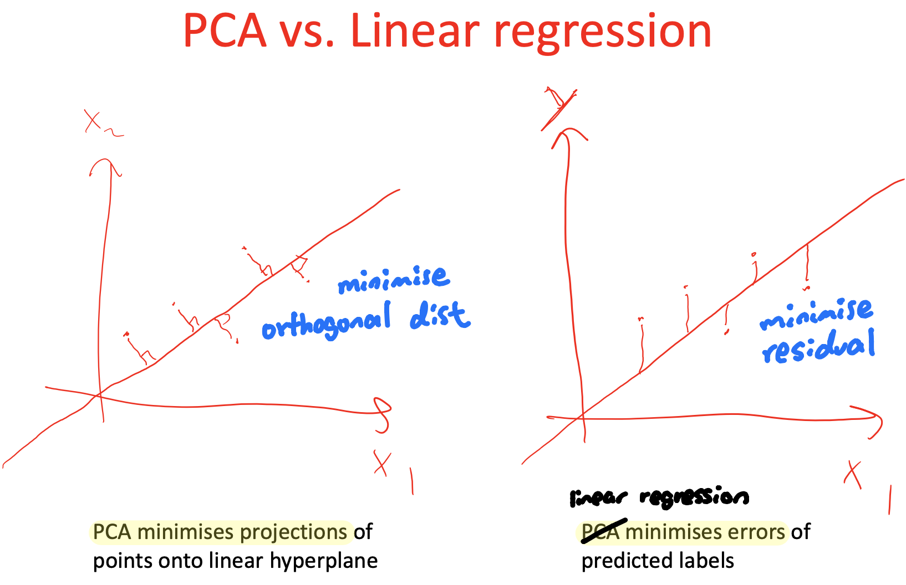

### Lecture 19: Dimensionality Reduction

#### Dimensionality reduction
* Representing data using **a smaller number of variables** while preserving the "interesting" structure of the data
* Purposes:
  * Visualisation
  * Computational efficiency in a pipeline
  * Data compression or statistical efficiency in a pipeline
* Results in loss of information in general
  * Trick: ensure that most of the "interesting" information (signal) is preserved (while what is lost is mostly noise)

#### Pricinpal component analysis (PCA)
* Popular method for dimensionality reduction and data analysis
* Aim: find **a new coordinate system** s.t. most of the **variance is concentrated** along the first coordinate, then most of the remaining variance along the second coordinate, etc.
* Dimensionality reduction is based on **discarding coordinates** except the first $l < m$
  
#### Formulating the problem
* Projection of u on v: $u_v = u \cdot v / ||v||$
  * If $||v|| = 1$, $u_v = u \cdot v$
* Vector $v$ can be considered as a candicate **coordinate axis**
  * and $u_v$ the coordinate of point $u$ (on the new coordinate axis)
* Data transformation
  * Projecting all data points to a new coordinate axis $p_1$
    * result: $X'p_i$
    * Where $||p_i|| = 1$
    * $X$ has original data points in columns
* Sample covariance matrix:
  * For centered (mean subtracted) matrix $X$
  * $\Sigma_X = \frac{1}{n-1}X'X$

#### PCA
* Objective:
  * assume the data is centered
  * find $p_1$ to maximise variance along this PC: $p_1' \Sigma_x p_1$ subject to ||p_1|| = 1
* Constrained problem -> Use Lagrange multipliers
* Solution: $p_1$ is the eigenvector with corresponding $\lambda_1$ being the **max** eigenvalue (of covariance matrix $\Sigma_X$)
  * Variance captured by PC1: $\lambda_1 = p_1' \Sigma_X p_1$
* (Spectrum of a matrix is a set of its eigenvalues)
* Choose dimensions to keep from "knee" in scree plot

#### Efficient algorithm for PCA
* Setting $p_i$ as all eigenvectors of the **centered** data covariance matrix $\Sigma_X$ in decreasing eigenvalue order
* Lemma: a real symmetric m x m matrix has m real eigenvalues and corresponding eigenvectors are orthogonal
* Lemma: a PSD matrix further has non-negative eigenvalues

#### Linear regression v.s. PCA
* Another view of PCA: $s-dim$ plane minimising residual sum squares to data
* It turns out: 
  * PCA chooses the **direction** to be a hyperplane that minimise these errors (RSS)
  * Since variance and squared distance have something in common (both sum of squares)

#### Additional effect of PCA
* Consider candidate axes $i$ and $(i+1)$, if there is correlation between them
  * This means that axis $i$ can be rotated further to capture more variance
* PCA should end up finding new axes (transformation) s.t. the transformed data is uncorrelated

#### Non-linear data and kernel PCA
* Low dimensional approximation need not be linear
* Kernel PCA: **map** data to feature space, **then** run **PCA**
  * Express PC in terms of data points
  * Solution uses X'X that can be kernelised:
    * $(X'X)_{ij} = K(x_i, x_j)$
  * Solution strategy differs from regular PCA
  * Modular: Changing kernel leads to a different feature space transformation