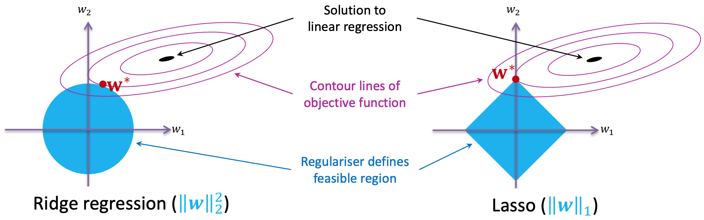
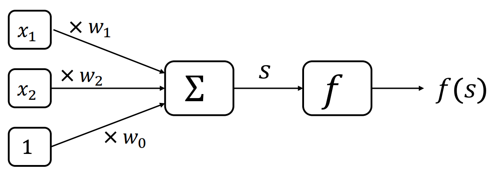

### Lecture 5: Regularisation

#### Irrelevant / Multicolinear features
* Co-linearity between features
* Features not linearly independent
  * E.g. If $x_1$ and $x_2$ are the same $\Rightarrow$ perfectly correlated
* For linear model, feature $X_j$ is irrelevant if
  * $X_j$ is a linear combination of other columns
  $$
    X_{.j} = \Sigma_{l \neq j} \alpha_{l}X_{.l}
  $$
  for some scalars $\alpha_l$
  * Equivalently: Some eigenvalue of $X'X$ is zero
* Problems
  1. The solution is not **unique**
     * Infinite number of solutions
  2. Lack of interpretability
     * cannot interpret the weights
  3. Optimising to learn parameter is **ill-posed problem**

#### Ill-posed problems
* Well-posed problem
  1. a solution exists
  2. the solution is unique
  3. the solution's behavior changes continuously with the initial condition
* If ill-posed, there is **no closed form solution**
  * Closed form solution $\hat{w} = (X'X)^{-1}X'y$
  * But if irrelevant, $X'X$ has no inverse (singular)
  * (Even near-irrelevance / colinearity can be problematic)

#### Re-conditioning the problem (Ridge Regression)
* Make it a well-posed solution and also prevent fitting noise / overfitting
* Original problem: minimise squared error
$$
    || y - Xw ||_2^2
$$ 
* Regularised problem (L2, **Ridge regression**): minimise
$$
    || y - Xw ||_2^2 + \lambda||w||_2^2 \text{ for } \lambda > 0
$$
  * Turns the ridge into a peak ($\Rightarrow$ unique solution)
  * Adds $\lambda$ to eigenvalues of $X'X$: makes invertible

#### Regulariser as a prior (Bayesian intepretation of ridge regression)
* Let prior distribution be:
$$
  W \sim N(0, 1/\lambda)
$$
* Higher $\lambda$, more confidence at prior, therefore ignore data more
* Computing posterior and take **MAP**
$$
  \text{log}(posterior) = \text{log}(likelihood) + \text{log}(prior) - \text{log}(marg)
$$
  * can just ignore $\text{log}(marg)$, since this term doesn't affect optimisation
* Arrive at the problem of minimising:
$$
  || y - Xw ||_2^2 + \lambda||w||_2^2
$$
* Become equivalent problem: Ridge Regression

---

#### Regularisation in non-linear models
* There is trade-off between **overfitting** and **underfitting**
* Right model class $\Theta$ will sacrifice some traininig error, for test error
* Choosing model complexity (2 Methods)
  1. Explicit model selection
       * Choosing degree of polynomial model by CV or held out validation
  2. Regularisation

#### Explicit model selection
* Using hold-out or CV to select the model
1. Split data into $D_{train}$ and $D_{validate}$ sets
2. For each degree d (# of parameters), we have model $f_d$
   1. Train $f_d$ on $D_{train}$
   2. Test (evaluate) $f_d$ on $D_{validate}$
3. Pick degree $\hat{d}$ that gives the best test score
4. Re-train model $f_{\hat{d}}$ using all data (return this final model)

#### Regularisation
* Solving the problem:
$$
  \hat{\theta} \in \argmin_{\theta \in \Theta} (L(data, \theta) + \lambda R(\theta))
$$
  * E.g. Ridge regression
  $$ 
    \hat{w} \in \argmin_{w \in W} ||y - Xw||_2^2 + \lambda||w||_2^2
  $$
* Note: regulariser $R(\theta)$ doesn't depend on data
* Use held-out validation / cross validation to choose $\lambda$

#### Regulariser as a constraint
* Modified problem: 
  * minimise $||y - Xw||_2^2$ subject to $||w||_2^2 \leq \lambda$ for $\lambda > 0$ 
  
  * $w^*$ is the solution
  * Lasso encourages solution to sit on the axes
    * Some of the weights are set to zero $\Rightarrow$ solution is sparse

#### Closed form solutions
1. Linear regression
  $$
    (X'X)^{-1}X'y
  $$
2. Ridge regression
  $$
    (X'X + \lambda I )^{-1}X'y
  $$
3. Lasso
   * No closed-form solution, but solutions are sparse and suitable for high-dim data

#### Bias-variance trade-off
* Model complexity is a major factor that influences the ability of the model to **generalise**
* Bias-variance decomposition
  * Risk / test error = $Bias^2 + Variance + Irreducible Error (noise)$
$$
  E[l(Y, \hat{f}(X_0))] = E[(Y - \hat{f})^2] = (E[Y] - E[\hat{f}])^2 + Var[\hat{f}] + Var[Y]
$$
* Squared loss for supervised-regression
$$
  l(Y, \hat{{f}(X_0)}) = (Y - \hat{f}(X_0))^2
$$
* Simple model $\Rightarrow$ high bias, low variance
* Complex model $\Rightarrow$ low bias, high variance

---

### Lecture 6: Perceptron

#### Artificial Neural Network (RNN, CNN, MLP)
* A network of processing elements
  * Each element converts inputs to output
  * Output: a (activation) function of a **weighted sum** of inputs (linear combination)
* To use ANN, we need
  * To design network topology
  * Adjust weights to given data
* Training an ANN $\Rightarrow$ adjusting weights for training data given a pre-defined network topology

#### Perceptron
* Perceptron is a binary classifier
  * $s = \sum_{i = 0}^m x_i w_i$
    * Predict class A if $s \geq 0$
    * Predict class B if $s < 0$
* Loss function
  * Usually don't use 0-1 loss for training, since cannot calculate the gradient
  * Shouldn't give penalty for correctly classified examples
    * Penalty (loss) = $s$
  * Can be re-written as $L(s,y) = max(0,-sy)$

#### Stochastic gradient descent (SGD)
* Stochastic = Random: shuffling training examples
* Randomly shuffle / split all training examples in B batches
* Choose initial $\theta^{(1)}$
* For $i$ from 1 to $T$ (epochs)
   * For $j$ from 1 to $B$ (batches)
      * Do gradient descent update **using data from batch $j$**
* Advantage: computational feasibility for large datasets

#### Perceptron training algorithm (SDG with batch size 1)
* Choose initial guess $w^{(0)}$, $k=0$
* For $i$ from 1 to $T$ (epochs)
  * For $j$ from 1 to $N$ (training examples)
    * Consider examples $\{\mathbf{x}_j, y_j \}$
    * Update: $w^{(k++)} = w^{(k)} - \eta \nabla L(w^{(k)})$
* Training rule (gradient descent)
  * Correct: We have $\frac{\partial L}{\partial w_i} = 0$ when $sy > 0$
  * Misclassified: We have $\frac{\partial L}{\partial w_i} = -x_i$ when y = 1 and $s < 0$
  * Misclassified: We have $\frac{\partial L}{\partial w_i} = x_i$ when y = -1 and $s > 0$
  * For sy = 0, we can do either of these (doesn't matter)
* When classified correctly, weights are unchanged
* When misclassified, update: $\mathbf{w}^{(k+1)} += -\eta(\pm \mathbf{x})$
  * $\pm x$ is gradient
* **Convergence theorem:** if the trianing data is linearly separable, the algorithm is guaranteed to **converge to a solution**. This is, there exist a finite $K$ s.t. $L(\mathbf{w}^K) = 0$
* **Pros and cons:**
  * Pros: if data is linearly separable, the perceptron trianing algorithm will converge to a correct solution
  * Cons: 
    * There are infinitely many possible solutions
    * If the data is not linearly separable, the training will fail completely rather than give some approx. solution
