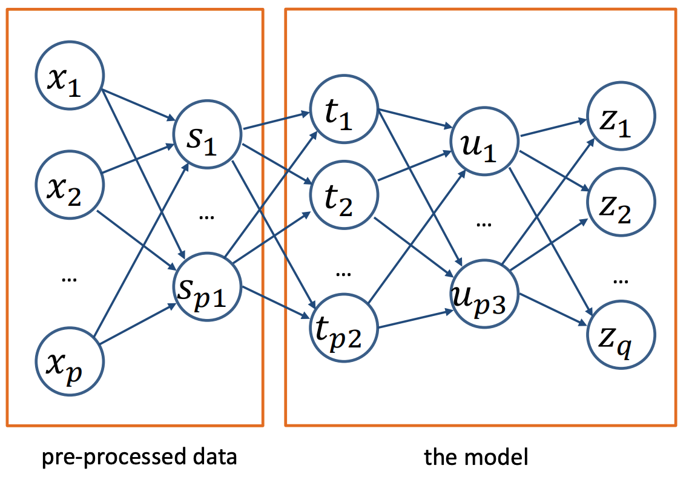
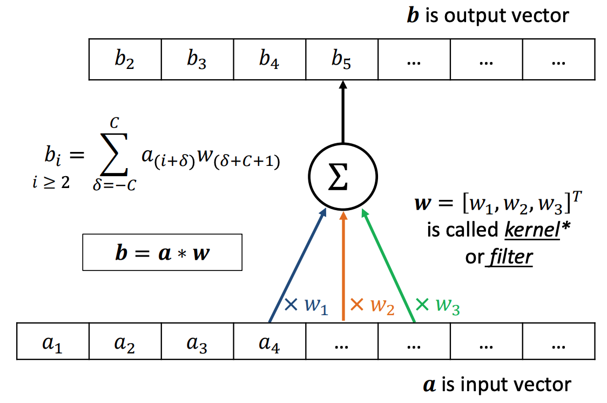
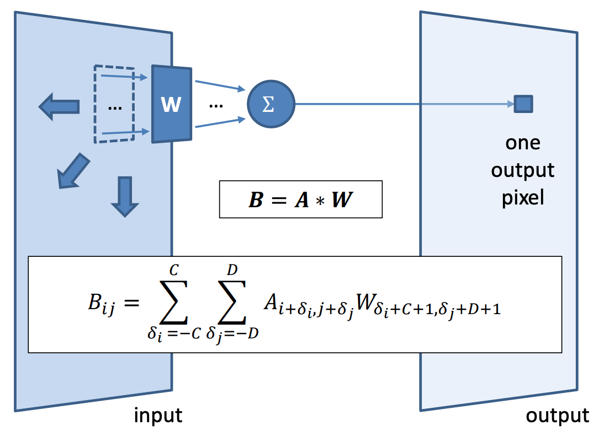
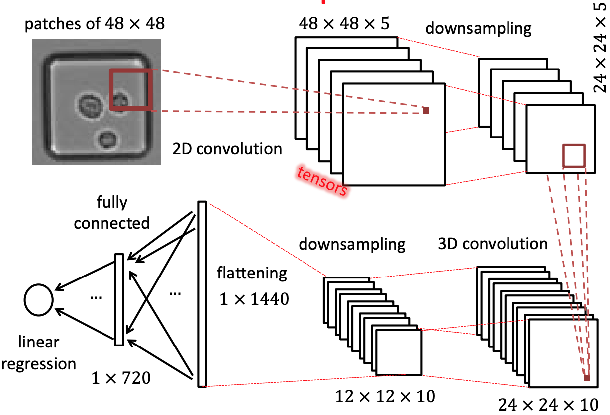
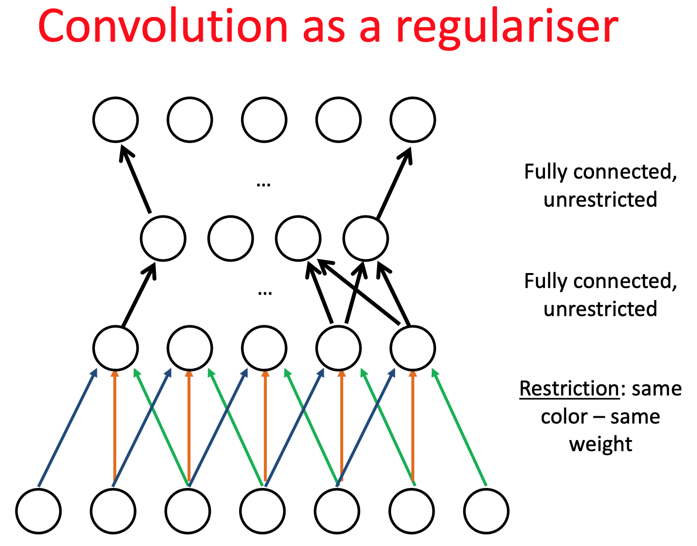
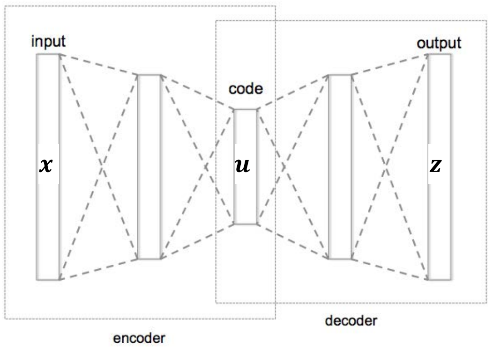

### Lecture 8: Deep learning, CNN, Autoencoders

#### Deep learning
* ANNs with a single hidden layer are **universal approximators**
  * E.g. OR, AND, NOT
* It's efficient to **stack** several hidden layers $\Rightarrow$ Deep neural networks

#### Representation learning
* Consecutive layers form **representations of the input** of increasing complexity
* ANN using complex non-linear representation
* A hidden layer can be though of as the *transformed feature space* (e.g. $\mathbf{u} = \phi(\mathbf{x})$)
* Parameters of such a transformation are learned from data
* ANN layers as data transformation:

#### Depth v.s. width
* Width: single infinitely wide layer gives a universal approximator
* Depth: yields more accurate models
* Seek to mimic layered complexity in a network
* However **vanishing gradient problem** affects learning with very deep models

#### Convolutional Neural Networks
* In this example
  * C = 1, (2C+1) is the filter size
  * Stride = 1

* For 2D images

* For computer vision
  * Use 5 filters for 2D convolution
  * Downsampling could be Max Pooling
  * Use 10 filters for 3D convolution

#### Components of CNN
* Convolutional layers
  * Complex input representations based on convolution operation
  * Weights of the filters are learned from training data
* Downsampling
  * Re-scales to smaller resolution, imits parameter explosion
  * Usually via Max Pooling
* Fully connected parts and output layer
  * Merges representations together

#### Downsampling via max pooling
* Special type of processing layer. For $m \times m$ patch
$$ v = max(u_{11}, u_{12}, ..., u_{mm}) $$
* Strictly speaking, not everywhere differentiable (pooling layers not differentiable). Instead, gradient is defined according to **"sub-gradient"**
* Max pooling:
  * Tiny changes in values of $u_{ij}$ that is not max do not change $v$
  * If $u_{ij}$ is max value, tiny changes in that value change $v$ linearly
  * Use $\frac{\partial v}{\partial u_{ij}} = 1$ if $u_{ij} = v$, and $\frac{\partial v}{\partial u_{ij}}$ otherwise
* **Forward pass** records maximising element, which is then used in the backward pass during back-propagation

#### Convolution as a regulariser

#### Autoencoder
* Given data without labels $x_1, ..., x_n$
  * Set $y_i \equiv x_i$ (target/output = input)
  * train an ANN to predict $z(x_i) \approx x_i$ (approximate input)
* Set bottleneck layer (**representation**) $u$ in middle "thinner" than input

#### Bottleneck
* Manage to train a network that gives a good **restoration** of the original signal $z(x_i) \approx x_i$
* That means that the data structure can be effectively **described (encoded) by a lower dimensional representation $\mathbf{u}$**

#### Dimensionality reduction
* Autoencoders can used for **compression** and **dimensionality reduction** via a non-linear **transformation**
* If you use **linear activation functions** and **only one hidden layer**, then the setup becomes almost that of **PCA**

