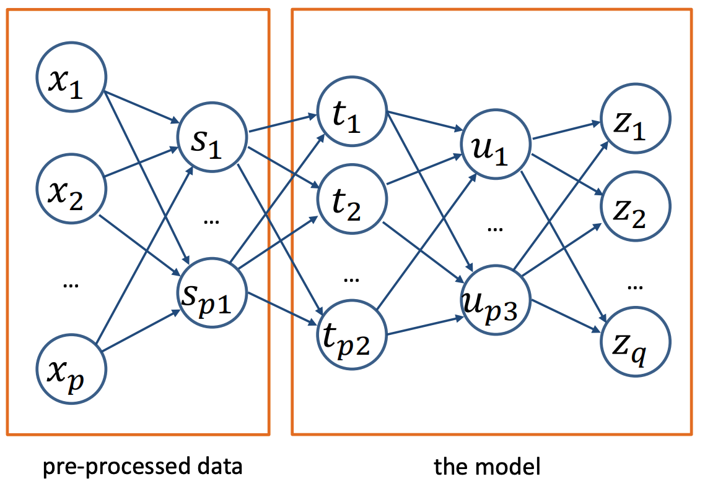
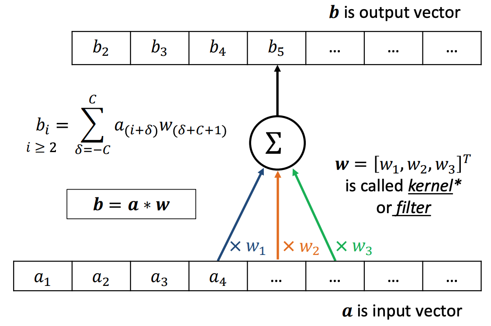
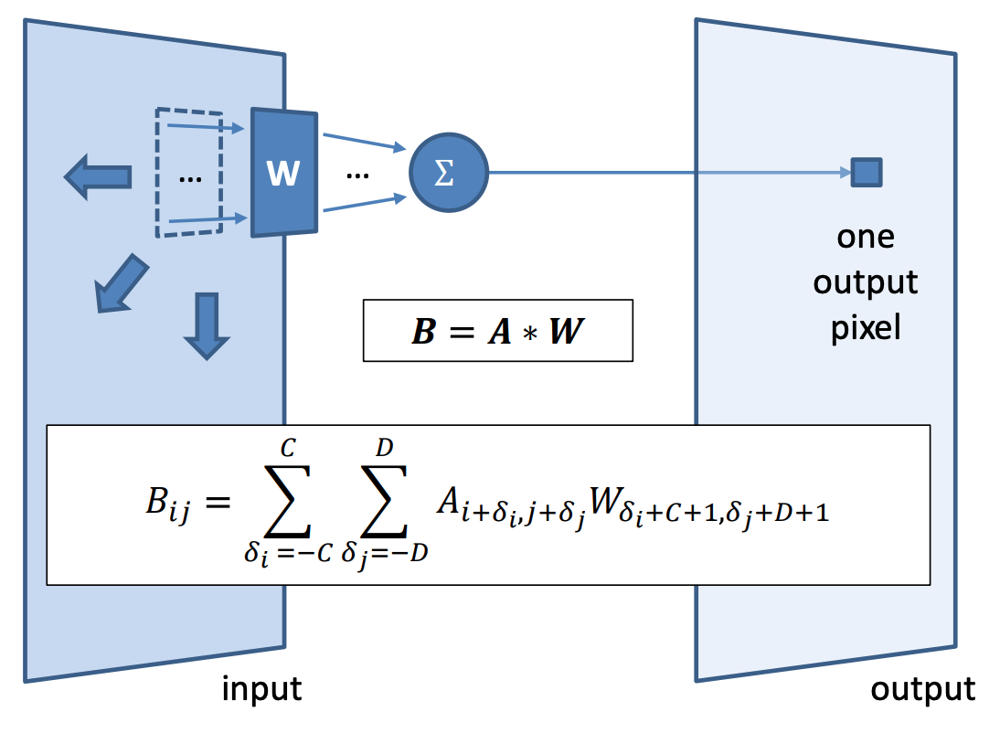
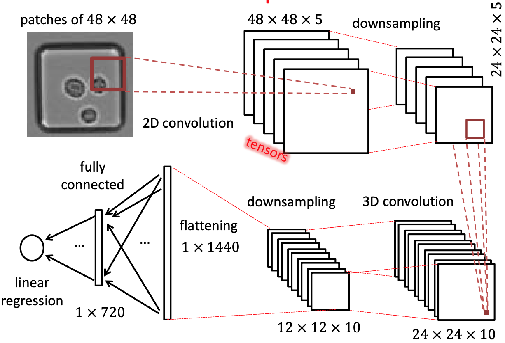
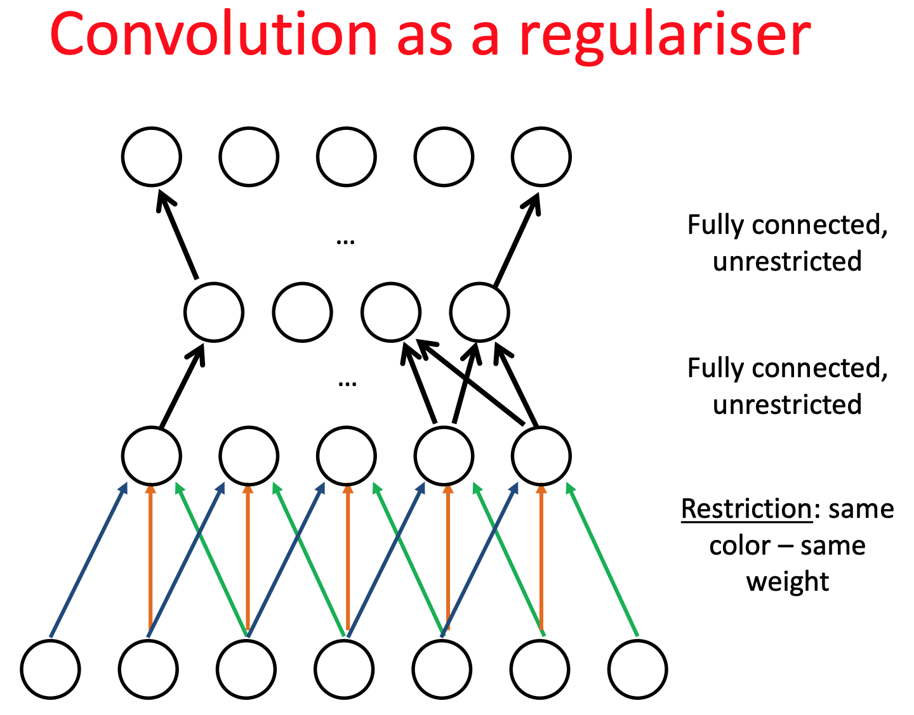
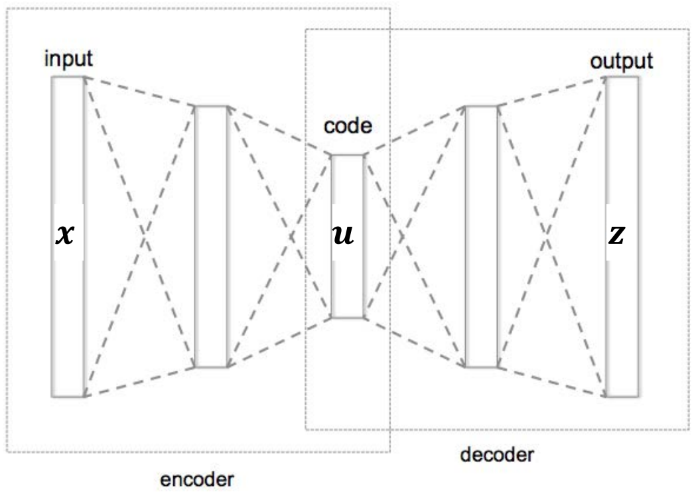
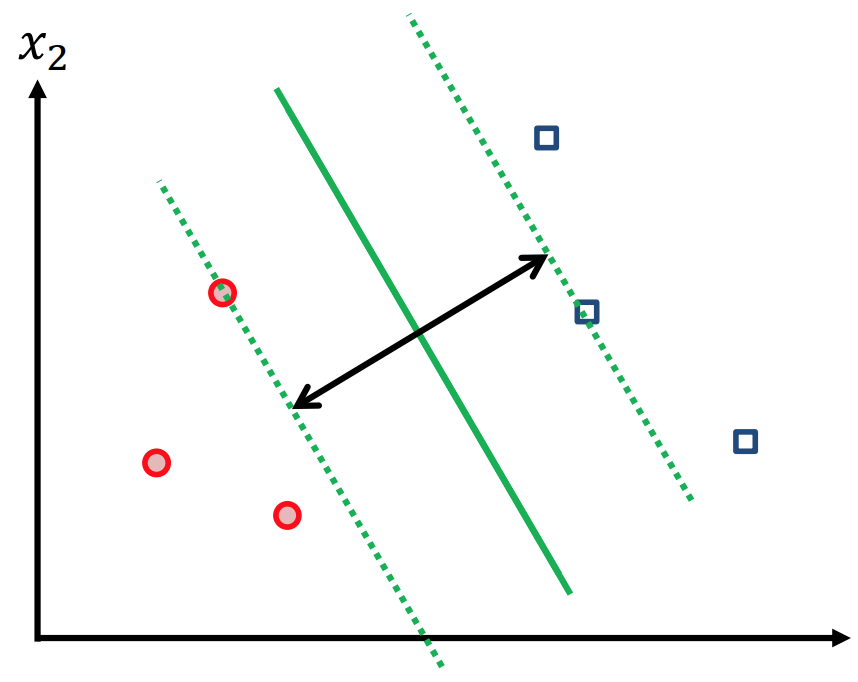

### Lecture 8: Deep learning, CNN, Autoencoders

#### Deep learning
* ANNs with a single hidden layer are **universal approximators**
  * E.g. OR, AND, NOT
* It's efficient to **stack** several hidden layers $\rightarrow$ Deep neural networks

#### Representation learning
* Consecutive layers form **representations of the input** of increasing complexity
* ANN using complex non-linear representation
* A hidden layer can be though of as the *transformed feature space* (e.g. $\mathbf{u} = \phi(\mathbf{x})$)
* Parameters of such a transformation are learned from data
* ANN layers as data transformation:
  

#### Depth v.s. width
* Width: single infinitely wide layer gives a universal approximator
* Depth: yields more accurate models
* Seek to mimic layered complexity in a network
* However **vanishing gradient problem** affects learning with very deep models

#### Convolutional Neural Networks
* In this example
  * C = 1, (2C+1) is the filter size
  * Stride = 1

* For 2D images

* For computer vision
  * Use 5 filters for 2D convolution
  * Downsampling could be Max Pooling
  * Use 10 filters for 3D convolution
  

#### Components of CNN
* Convolutional layers
  * Complex input representations based on convolution operation
  * Weights of the filters are learned from training data
* Downsampling
  * Re-scales to smaller resolution, imits parameter explosion
  * Usually via Max Pooling
* Fully connected parts and output layer
  * Merges representations together

#### Downsampling via max pooling
* Special type of processing layer. For $m \times m$ patch
$$ v = max(u_{11}, u_{12}, ..., u_{mm}) $$
* Strictly speaking, not everywhere differentiable (pooling layers not differentiable). Instead, gradient is defined according to **"sub-gradient"**
* Max pooling:
  * Tiny changes in values of $u_{ij}$ that is not max do not change $v$
  * If $u_{ij}$ is max value, tiny changes in that value change $v$ linearly
  * Use $\frac{\partial v}{\partial u_{ij}} = 1$ if $u_{ij} = v$, and $\frac{\partial v}{\partial u_{ij}}$ otherwise
* **Forward pass** records maximising element, which is then used in the backward pass during back-propagation

#### Convolution as a regulariser

#### Autoencoder
* Given data without labels $x_1, ..., x_n$
  * Set $y_i \equiv x_i$ (target/output = input)
  * train an ANN to predict $z(x_i) \approx x_i$ (approximate input)
* Set bottleneck layer (**representation**) $u$ in middle "thinner" than input

#### Bottleneck
* Manage to train a network that gives a good **restoration** of the original signal $z(x_i) \approx x_i$
* That means that the data structure can be effectively **described (encoded) by a lower dimensional representation $\mathbf{u}$**

#### Dimensionality reduction
* Autoencoders can used for **compression** and **dimensionality reduction** via a non-linear **transformation**
* If you use **linear activation functions** and **only one hidden layer**, then the setup becomes almost that of **PCA**

### Lecture 9: Support Vector Machine

#### Linear hard-margin SVM
* **Binary classifier**
  * $s = b + \sum_{i = 1}^m x_i w_i$
  * Predict class A if $s \geq 0$
  * Predict class B if $s < 0$
* **Linear classifier**
  * $s$ is a linear function of inputs, and the **separating boundary** is linear
* Model the data as **linearly separable**
  * There exists a hyperplane perfectly separating the classes
* Training using all data at once

#### SVM vs. Perceptron
* Given learned parameter value, an **SVM makes predictions exactly like a perceptron**
* Different ways to learn parameter
  * SVM: maximise margin
  * Perceptron: min perceptron loss

#### Separation boundary
* Choosing parameters means choosing a separating boundary (hyperplane)
* **For perceptron,** all boundaries that separates classes perfectly are equally good
  * since perceptron loss is 0 for all of them
* **For SVM,** it aim to find the separation boundary that maximises the margin between the classes
* **Margin** is defined by the **location(b) and orientation(w)** of the separating boundary, which are defined by SVM parameters
  * Space between two dashed lines

#### Margin width
* Distance between the hyperplane and the nearest data points
  * therefore, **distance to the nearest red and blue points are the same**
* Points on margin boundaries called **support vectors**
  

#### SVM Parameters
* The separation boundary is defined by parameters $\mathbf{w}$ and $b$
  * $\mathbf{w}$: vetor normal (perpendicular) to the boundary
  * $b$: bias / intercept
* For a point X, let $X_p$ denote the **projection** of X onto the hyperplane
* Distance from point to hyperplane
  * $||r|| = \pm \frac{w'x + b}{||w||}$
* In training data, $y_i$ corresponds to binary label (-1 or 1)
  * $y_i$ encode the side of the boundary each $x_i$ is on
* Thus, **distance from i-th point** to a perfect hyperplane:
  * $||r_i|| = \frac{y_i(w'x_i + b)}{||w||}$

#### SVM: Finding separating boundary
* Margin width = distance from the hyperplane to the closest point
* **SVM Objective:** 
  * Maximise ($\min_{i = 1, ..., n} \frac{y_i(w'x_i + b)}{||w||}$) as a function of $\mathbf{w}$ and $b$
  * Problem: non-unique representation of separating boundary (hyperplane)
    * i.e. can use any $\alpha (w'x + b) = \tilde{w}'x + \tilde{b} = 0$
    * Infinite number of solutions
  * Possible solution to **resolve ambiguity**: 
  * Measure the distance to the closest point ($i^*$) and rescale param s.t. 
    * margin: $\frac{y_{i^*}(w'x_{i^*} + b)}{||w||} = \frac{1}{||w||}$
    * (Arbitrary set the numerator to 1 to get unique values of $\mathbf{w}$ and $b$)
* **SVM Objective with extra requirement:**
  * Extra requirement: Set margin width = $\frac{y_{i^*}(w'x_{i^*} + b)}{||w||} = \frac{1}{||w||}$
  * $i^*$ denotes index of closest example to boundary
* Therefore, (hard margin) SVM aims to find:
  * $\argmin_w ||w||$ s.t. $y_i (w'x_i + b) \geq 1$ for $i = 1, ..., n$
  * Minimum $||w||$ => maximise margin
  * Constraint: perfect separation of points

#### SVM as regularised ERM
* SVM objective
  * $\argmin_w ||w||$: data-independent regularisation term
  * $y_i (w'x_i + b) \geq 1$ for $i = 1, ..., n$: constraints as data-dependent training error
    * Can be interpreted as loss
      * $l_\infty = 0$ if prediction correct
      * $l_\infty = \infty$ if prediction wrong (give infinite loss to make perfect separation)