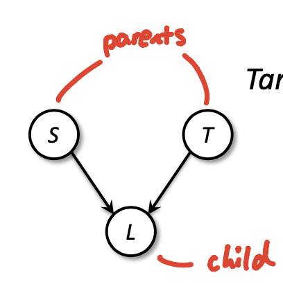
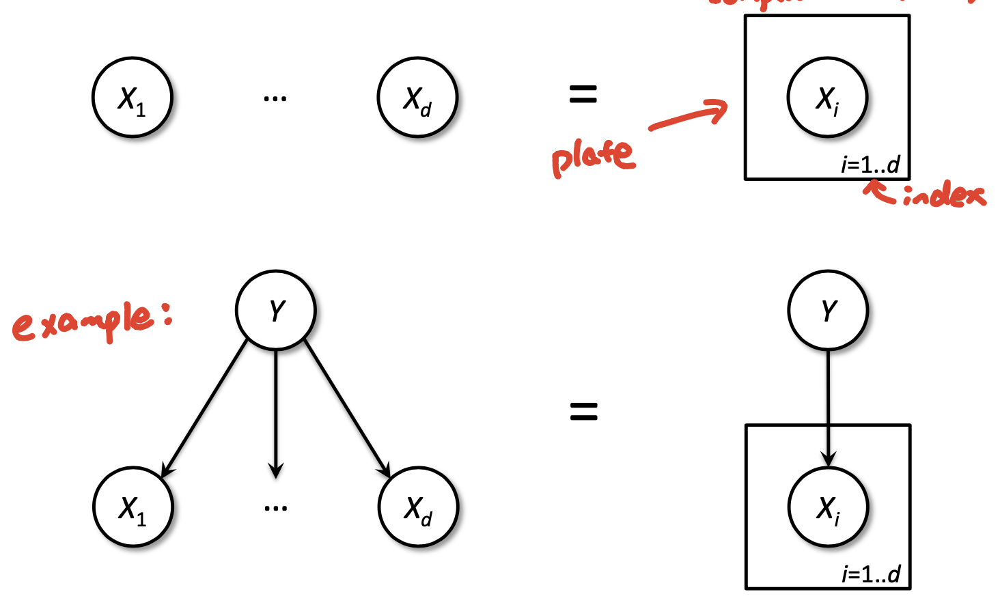
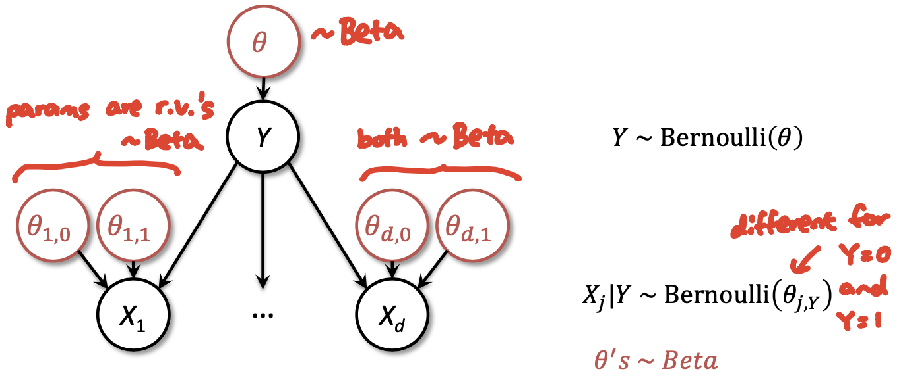
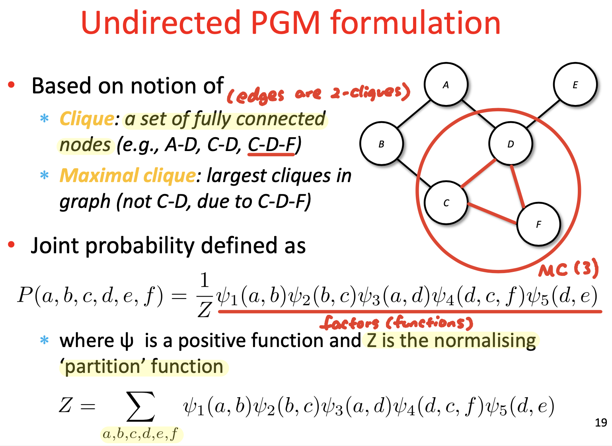

### Lecture 16: PGM Representation

#### PGM
* Mariage of graph theory and probability theory
* Tool of choice for Bayesian statistical learning

#### Bayesian statistical learning v.s. PGM (aka. "Bayes Nets")
* Bayesian Statistical learning
  * Model joint distribution of $X$'s, $Y$, and parameters $r.v.$'s
  * Priors: marginals on parameters
  * Training:
    * update prior to posterior using observed data
  * Prediction:
    * output posterior, or some function of it (MAP)
* PGM ("Bayes Nets")
  * Efficient joint representation
    * Independence made explicit
    * Trade-off between expressiveness and need for data, easy to make
    * Easy for Practitioners to model
  * Algorithms to fit parameters, compute marginals, posterior

#### Joint distribution
* All joint distributions on discrete $r.v.$'s can be represented as table
  * Table assign probability per row
* We can make probabilistic inference from joint on $r.v.$'s
  * Compute any other distributions involving our $r.v.$'s
  * **Bayes rule + marginalisation**
  * Example: Naive Bayes
* Bad: Computational complexity
  * Tables have exponential number of rows in number of $r.v.$'s
  * Therefore -> poor space & time to marginalise
* Ugly: Model complexity
  * Way too flexible
  * Way too many parameters to fit
    * Need lots of data OR will overfit

#### Independence
* If assume S, T independent, model need 6 params
  * $P(S,T)$ factors to P(S), P(T) -> 2 params
  * $P(L|T,S)$ modelled in full -> 4 params
* For assumption-free model, need 7 params
  * $P(L,T,S)$ modelled in full -> $2^3-1 = 7$ params
* Independence assumptions
  * Can be reasonable in light of domain expertise
  * Allow us to **factor** -> Key to tractable models

#### Factoring Joint Distributions
* Chain Rule: For **any ordering** of $r.v.'s$ can always factor:
  * $P(X_1, X_2, ..., X_k) = \prod_{i=1}^k P(X_i | X_{i+1}, ..., X_k)$
* Model's independence assumptions correspond to:
  * Dropping conditioning $r.v.$'s in the factors
  * E.g. Unconditional independence: $P(X_1 | X_2) = P(X_1)$
  * E.g. Conditional independence: $P(X_1 | X_2, X_3) = P(X_1 | X_2)$ 
    * Given $X_2$, $X_1$ and $X_3$ independent
* Simpler factors: speed up inference and avoid overfitting

#### Directed PGM
* Nodes -> Random variables
* Edges -> Conditional independence
  * Node table: $P(child|parents)$
  * Child **directly** depends on parents
* **Joint factorisation**
  * $P(X_1, ..., X_k) = \prod_{i=1}^k P(X_i | X_j \in parents(X_i))$

#### Plate notation
* Short-hand for repeats
* Simplifying growing complicated PGM

#### PGM: frequentist v.s. Bayesian
* PGM -> joints
* Bayesian add: node per param

#### Undirected PGMs
* Parameterised by **arbitrary positive valued functions** of the variables and **global normalisation**
  * Aka. Markov Random Field
* Undirected v.s. Directed PGM
  * Undirected:
    * Graph with undirected edges
    * Probability:
      * Each node a $r.v.$
      * Each **clique $\mathbf{C}$ has "factor"**: 
        * $\psi_C(X_j:j \in C) \geq 0$
  * Directed:
    * Graph with directed edges
    * Probability:
      * Each node a $r.v.$
      * Each **node has conditional probability**:
        * $p(X_i | X_j \in parents(X_i))$
      * Joint = product of conditional probabilities

#### Undirected PGM formulation
* Based on notion of:
  * Clique: a set of **fully connecte**d nodes
  * Maximal clique: largest cliques in graph
* Joint probability defined as:
  * $P(a,b,c,d,e,f) = \frac{1}{Z} \psi_1(a,b) \psi_2(b,c) \psi_3(a,d) \psi_4(d,c,f) \psi_5(d,e)$
  * where $\psi$ is a **positive function**
  * and $Z$ is the **normalising** "partition" function
    * $Z = \sum_{a,b,c,d,e,f} \psi_1(a,b) \psi_2(b,c) \psi_3(a,d) \psi_4(d,c,f) \psi_5(d,e)$

####