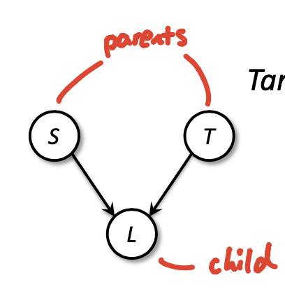
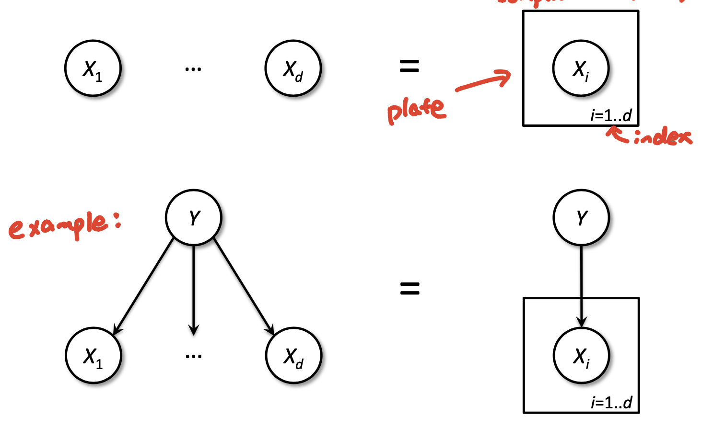
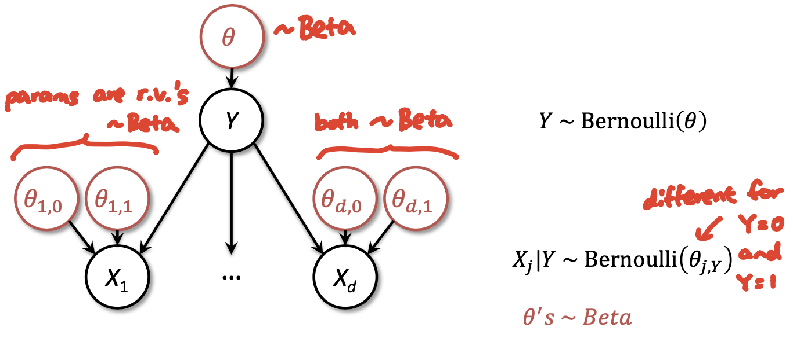
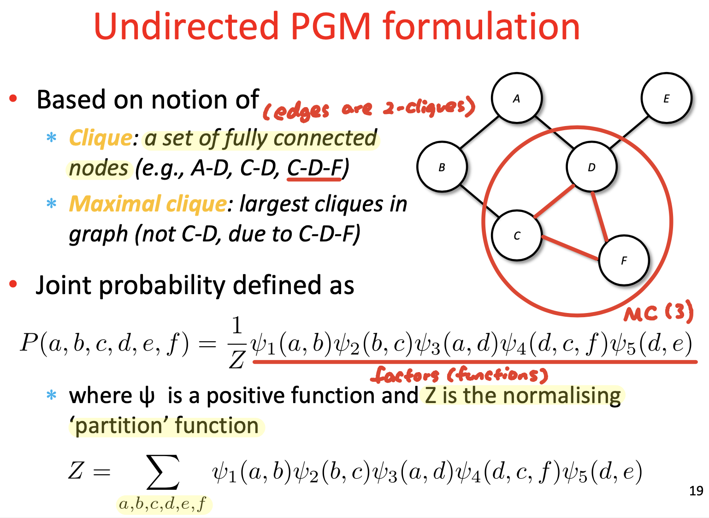
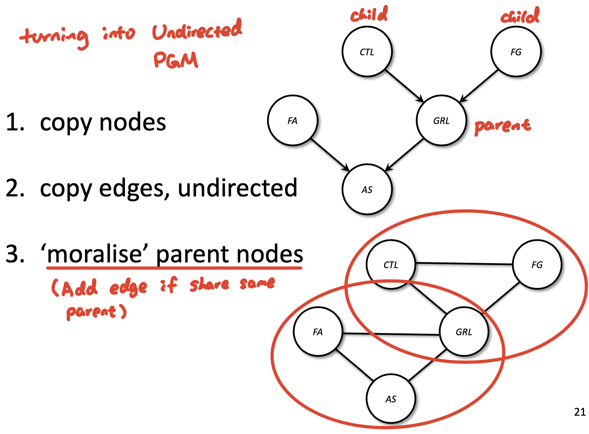
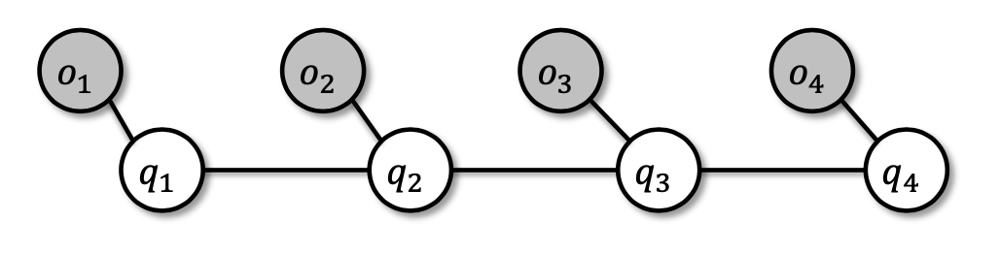
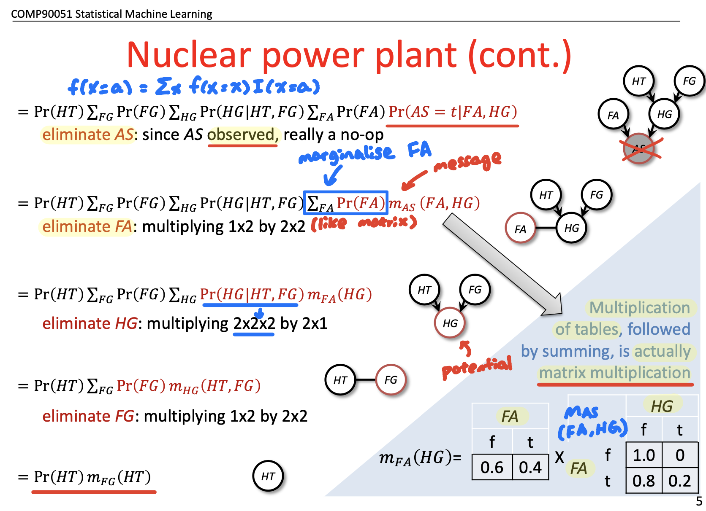
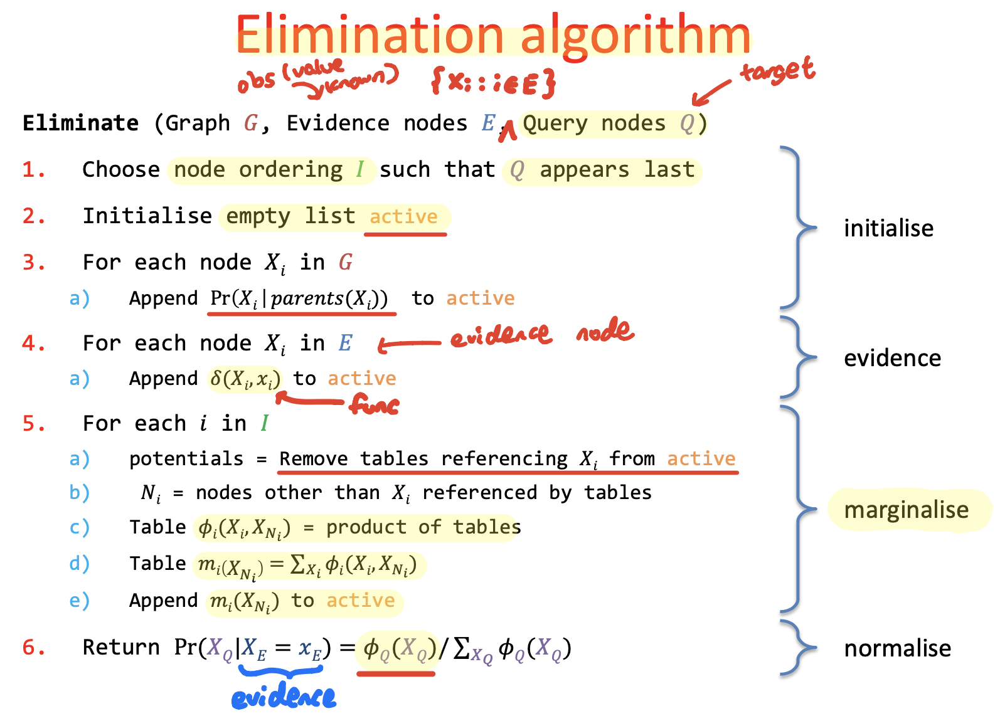

### Lecture 16: PGM Representation

#### PGM
* Mariage of graph theory and probability theory
* Tool of choice for Bayesian statistical learning

#### Bayesian statistical learning v.s. PGM (aka. "Bayes Nets")
* Bayesian Statistical learning
  * Model joint distribution of $X$'s, $Y$, and parameters $r.v.$'s
  * Priors: marginals on parameters
  * Training:
    * update prior to posterior using observed data
  * Prediction:
    * output posterior, or some function of it (MAP)
* PGM ("Bayes Nets")
  * Efficient joint representation
    * Independence made explicit
    * Trade-off between expressiveness and need for data, easy to make
    * Easy for Practitioners to model
  * Algorithms to fit parameters, compute marginals, posterior

#### Joint distribution
* All joint distributions on discrete $r.v.$'s can be represented as table
  * Table assign probability per row
* We can make probabilistic inference from joint on $r.v.$'s
  * Compute any other distributions involving our $r.v.$'s
  * **Bayes rule + marginalisation**
  * Example: Naive Bayes
* Bad: Computational complexity
  * Tables have exponential number of rows in number of $r.v.$'s
  * Therefore -> poor space & time to marginalise
* Ugly: Model complexity
  * Way too flexible
  * Way too many parameters to fit
    * Need lots of data OR will overfit

#### Independence
* If assume S, T independent, model need 6 params
  * $P(S,T)$ factors to P(S), P(T) -> 2 params
  * $P(L|T,S)$ modelled in full -> 4 params
* For assumption-free model, need 7 params
  * $P(L,T,S)$ modelled in full -> $2^3-1 = 7$ params
* Independence assumptions
  * Can be reasonable in light of domain expertise
  * Allow us to **factor** -> Key to tractable models

#### Factoring Joint Distributions
* Chain Rule: For **any ordering** of $r.v.'s$ can always factor:
  * $P(X_1, X_2, ..., X_k) = \prod_{i=1}^k P(X_i | X_{i+1}, ..., X_k)$
* Model's independence assumptions correspond to:
  * Dropping conditioning $r.v.$'s in the factors
  * E.g. Unconditional independence: $P(X_1 | X_2) = P(X_1)$
  * E.g. Conditional independence: $P(X_1 | X_2, X_3) = P(X_1 | X_2)$ 
    * Given $X_2$, $X_1$ and $X_3$ independent
* Simpler factors: speed up inference and avoid overfitting

#### Directed PGM
* Nodes -> Random variables
* Edges -> Conditional independence
  * Node table: $P(child|parents)$
  * Child **directly** depends on parents
* **Joint factorisation**
  * $P(X_1, ..., X_k) = \prod_{i=1}^k P(X_i | X_j \in parents(X_i))$

#### Plate notation
* Short-hand for repeats
* Simplifying growing complicated PGM

#### PGM: frequentist v.s. Bayesian
* PGM -> joints
* Bayesian add: node per param

#### Undirected PGMs
* Parameterised by **arbitrary positive valued functions** of the variables and **global normalisation**
  * Aka. Markov Random Field
* Undirected v.s. Directed PGM
  * Undirected:
    * Graph with undirected edges
    * Probability:
      * Each node a $r.v.$
      * Each **clique $\mathbf{C}$ has "factor"**: 
        * $\psi_C(X_j:j \in C) \geq 0$
      * Joint $\propto$ product of factors
  * Directed:
    * Graph with directed edges
    * Probability:
      * Each node a $r.v.$
      * Each **node has conditional probability**:
        * $p(X_i | X_j \in parents(X_i))$
      * Joint = product of conditional probabilities
  * Key difference = **normalisation**
    * $\propto$ in undirected PGM

#### Undirected PGM formulation
* Based on notion of:
  * Clique: a set of **fully connecte**d nodes
  * Maximal clique: largest cliques in graph
* Joint probability defined as:
  * (Product of all the cliques)
  * $P(a,b,c,d,e,f) = \frac{1}{Z} \psi_1(a,b) \psi_2(b,c) \psi_3(a,d) \psi_4(d,c,f) \psi_5(d,e)$
  * where $\psi$ is a **positive function**
  * and $Z$ is the **normalising** "partition" function
    * $Z = \sum_{a,b,c,d,e,f} \psi_1(a,b) \psi_2(b,c) \psi_3(a,d) \psi_4(d,c,f) \psi_5(d,e)$

#### Directed to undirected
* Directed PGM formulated as:
  * $P(X_1, ..., X_k) = \prod_{i=1}^{k} P(X_i | X_{\pi_i})$
  * where $\pi$ indexes parents
* Equivalent to U-PGM with
  * each **conditional probability** term is **included** in one factor function, $\psi_c$:
    * clique structure links **groups of variables**
    * normalisation term trivial, Z = 1
* Turning D-PGM to U-PGM:

#### Why U-PGM
* Pros:
  * **Generalisation** of D-PGM
  * Simpler means of modelling without the need for per-factor normalisation
  * General inference algorithms use U-PGM representation
    * (Support both types of PGM)
* Cons:
  * (Slightly) weaker independence
  * Calculating global normalisation term (Z) intractable in general

#### PGM examples
* Hidden Markov Model (HMM)
  * **Directed**
  * Sequential observed outputs from hidden states
  * States: ejections & transitions
  * 2 assumptions:
    * Markov assumption
    * Output independence assumption
  * Applications:
    * NLP
    * Speech recognition
    * Biological sequences
    * Computer vision
  * Fundamental tasks (corresponding):
    * HMM: 
      * Evaluation: determine likelihood $P(O | \mu)$
        * $O$: observation sequence
        * $\mu$: HMM
      * Decoding: determine most probable hidden state $Q$
      * Learning: learn parameters $A, B, \Pi$
    * PGM:
      * Probabilistic inference
      * MAP point estimate
      * Statistical inference
* Kalman filter
  * Same with continuous Gaussian $r.v.$'s
* Conditional Random Field (CRF)
  * **Undirected**
  * Same model applied to sequences
    * Observed outputs are words, speech, etc.
    * States are tags: part-of-speech, alignment, etc.
  * Discriminative: model $P(Q | O)$
    * v.s. HMM's which are generative $P(Q, O)$
    * undirected PGM more general and expressive

### Lecture 17: PGM Probabilistic and Statistical Inference

#### Probabilistic inference on PGMs
* Computing marginal and conditional distributions from the joint of a PGM 
  * Using **Bayes rule and marginalisation**
* Joint + Bayes rule + marginalisation -> anything !
* Example:
  * $P(HT | AS = t) = \frac{P(HT,AS=t)}{P(AS=t)} = \frac{\Sigma_{FG, HG, FA} P(AS=t, FA, HG, FG, HT)}{\Sigma_{FG, HG, FA, HT'} P(AS=t, FA, HG, FG, HT')}$
  * $HT'$ means All values of HT
  * Numerator: $\Sigma_{FG, HG, FA} P(HT) P(HG | HT, FG) P(FG) P(AS=t | FA, HG) P(FA)$
    * Can distribute the sums as far down as possible: $P(HT)\Sigma_{FG} P(FG) \Sigma_HG P(HG|HT, FG) \Sigma_FA P(FA) P(AS = t | FA, HG)$

#### Elimination algorithm

#### Statistical inference on PGMs
* Learning (tables / params) from data
  * Fitting probability tables to observations
  * E.g. as a frequentist; a Bayesian would just use probabilistic inference to updat prior to posterior
* Probabilistic inference
  * **Computing other distributions** from joint
  * Elimination, sampling algorithms
* Statistical inference
  * Learn **parameters** from data
1. Fully-observed case (easy)
   * MLE -> maximise full joint (likelihood)
     * $\argmax_{\theta \in \Theta} \prod_{i=1}^n \prod_j p(X^j = x_i^j | X^{parents(j)} = x_i^{parents(j)})$
   * Decomposes easily, leads to **counts-based estimates**
     * Maximise log-likelihood instead; become sum of logs
     * Big maximisation of all params together, **decouples into small independent problems**
    * Example: 
      * Training a naive bayes classifier
      * (Counting -> probabilities)
2. Presense of **unobserved** variables
   * Latent, or unobserved variables
   * MLE:
     * Maximise likelihood of observed data only
     * Marginalise full joint to get desired "partial" joint
       * This won't decouple
   * Solution: Use **EM algorithm** !